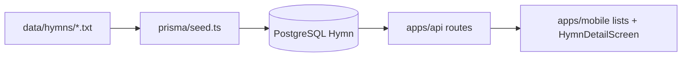
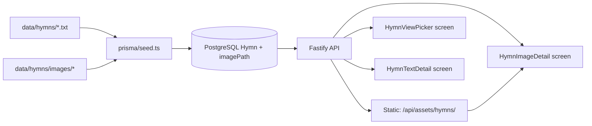

# Hymn App — Development Plan

## Vision & MVP scope

Hymn App is a mobile hymn reader backed by a Fastify API and PostgreSQL. The **frontend is already wired** for browsing, searching, and reading hymn lyrics. The next MVP increment focuses on the **backend and dual hymn views**:

- **Text view** — full lyrics (existing behavior, refactored into its own screen)
- **Image view** — sheet music / hymn image (new)
- **Audio** — planned for a later phase (out of MVP)

This document tracks decisions, implementation phases, and checklists for that work.

---

## Current baseline

The monorepo already has a working **text-only** pipeline:



| Layer | Status |
|-------|--------|
| Backend API | List, search, detail — read-only |
| Data model | `Hymn { title, author, lyrics }` |
| Seed | Parses `.txt` files from `data/hymns/` |
| Mobile | Browse, Favorites, Contents → single text detail screen |
| Shared types | `@hymn-app/shared-types` keeps API and mobile in sync |

**Key files today:**

- [`apps/api/src/routes/hymns.ts`](../apps/api/src/routes/hymns.ts)
- [`prisma/schema.prisma`](../prisma/schema.prisma)
- [`prisma/seed.ts`](../prisma/seed.ts)
- [`apps/mobile/src/screens/HymnViewPickerScreen.tsx`](../apps/mobile/src/screens/HymnViewPickerScreen.tsx)
- [`apps/mobile/src/screens/HymnTextDetailScreen.tsx`](../apps/mobile/src/screens/HymnTextDetailScreen.tsx)
- [`apps/mobile/src/screens/HymnImageDetailScreen.tsx`](../apps/mobile/src/screens/HymnImageDetailScreen.tsx)
- [`packages/shared-types/src/index.ts`](../packages/shared-types/src/index.ts)

---

## Target architecture (MVP)



---

## Decisions log

| Topic | Decision | Notes |
|-------|----------|-------|
| Detail UI | **Two separate stack screens** | `HymnTextDetail` and `HymnImageDetail` (not tabs on one screen) |
| Image storage | **Recommended: local static files (Option A)** | Final choice TBD — see options below |
| Image pairing | Same basename as `.txt` file | `amazing-grace.txt` → `data/hymns/images/amazing-grace.jpg` |
| Supported formats | `.jpg`, `.jpeg`, `.png` | First match wins during seed |
| Missing image | `imageUrl: null` in API | Image screen shows friendly empty state |
| List/search payload | Text-only (`HymnSummary`) | No thumbnails in MVP |
| DB migrations | Continue `prisma db push` | No migration folder for MVP |

### Image storage options

| Option | Description | MVP fit |
|--------|-------------|---------|
| **A. Local static files** | Store under `data/hymns/images/`, serve via `@fastify/static` | **Recommended** — matches `.txt` workflow, zero cloud cost |
| **B. URL-only in DB** | Seed stores external `imageUrl` | Simple API, but manual hosting |
| **C. DB blob** | Image bytes in Postgres | Not recommended for sheet music |

**Recommendation:** Option A for MVP. Store a relative `imagePath` in the database; the API builds an absolute `imageUrl` in responses. Later, swap the URL builder for S3/R2 without changing the mobile contract.

### Navigation UX

- Stack routes: `HymnViewPicker { hymnId }`, `HymnTextDetail { hymnId }`, `HymnImageDetail { hymnId }`
- From list: tap opens **HymnViewPicker** — user chooses **Lyrics** or **Notes** (sheet music)
- Detail screens share header patterns: back, title, author, favorite star
- Cross-link icons on text/image detail screens to jump between views without returning to picker

---

## API contract

### Extended `Hymn` type (detail only)

```typescript
interface Hymn {
  id: string;
  title: string;
  author: string;
  lyrics: string;
  imageUrl: string | null;  // absolute URL when image exists
  createdAt: string;
  updatedAt: string;
}
```

`HymnSummary` (list/search) stays unchanged: `id`, `title`, `author`.

### Endpoints

| Method | Path | Change |
|--------|------|--------|
| GET | `/api/hymns` | No change |
| GET | `/api/hymns/search?q=` | No change |
| GET | `/api/hymns/:id` | Add `imageUrl` to response |
| GET | `/api/assets/hymns/:filename` | **New** — static image files |

Example detail response:

```json
{
  "success": true,
  "data": {
    "id": "clx...",
    "title": "Amazing Grace",
    "author": "John Newton",
    "lyrics": "Amazing grace! How sweet the sound\n...",
    "imageUrl": "http://192.168.1.10:3000/api/assets/hymns/amazing-grace.jpg",
    "createdAt": "2026-01-01T00:00:00.000Z",
    "updatedAt": "2026-01-01T00:00:00.000Z"
  }
}
```

When no image file exists for a hymn, `imageUrl` is `null`.

---

## Implementation phases

### Phase 0 — Decisions & assets

- [x] Confirm image storage choice (Option A — local static files)
- [ ] Add sheet images for sample hymns under `data/hymns/images/` (user-provided):
  - [ ] `amazing-grace.jpg` (or `.png`)
  - [ ] `how-great-thou-art.jpg` (or `.png`)
- [ ] Document image pairing in [`INSTRUCTIONS.md`](../INSTRUCTIONS.md)

### Phase 1 — Schema & shared types

**Files:** [`prisma/schema.prisma`](../prisma/schema.prisma), [`packages/shared-types/src/index.ts`](../packages/shared-types/src/index.ts)

- [x] Add optional `imagePath String?` to `Hymn` model
- [x] Run `npm run db:push`
- [x] Add `imageUrl: string | null` to shared `Hymn` interface

### Phase 2 — Seed pipeline

**Files:** [`prisma/seed.ts`](../prisma/seed.ts)

- [x] After parsing each `.txt`, look for matching image by basename
- [x] Upsert `imagePath` when file exists; set `null` when absent
- [x] Log warnings for hymns missing images (optional)

### Phase 3 — API static serving & response mapping

**Files:** [`apps/api/src/index.ts`](../apps/api/src/index.ts), [`apps/api/src/routes/hymns.ts`](../apps/api/src/routes/hymns.ts)

- [x] Install and register `@fastify/static` for `data/hymns/images/`
- [x] Update `toHymn()` mapper to build absolute `imageUrl` from `imagePath`
- [ ] Verify with curl/browser: JSON detail + direct image URL (after user uploads images)

### Phase 4 — Mobile: dual detail screens

**Files:** navigation types, `RootNavigator`, `HymnViewPickerScreen`, `HymnTextDetailScreen`, `HymnImageDetailScreen`

- [x] Register `HymnViewPicker`, `HymnTextDetail`, and `HymnImageDetail` on root stack
- [x] List tap → picker; user chooses Lyrics or Notes
- [x] `HymnImageDetailScreen`: render `Image` with `uri: hymn.imageUrl`, `resizeMode="contain"`
- [x] Empty state when `imageUrl` is null
- [x] Separate error handling for image load vs. API fetch
- [x] Cross-link between text and image detail screens

### Phase 5 — Docs & smoke test

- [ ] Update [`INSTRUCTIONS.md`](../INSTRUCTIONS.md) with image workflow and new screens
- [ ] Manual test matrix:
  - [ ] List → text detail → back
  - [ ] List → image detail (with image)
  - [ ] Image detail empty state (hymn without image)
  - [ ] Search → both screens
  - [ ] Physical device over LAN IP (not `localhost`)

---

## Dev environment checklist

Before starting implementation, confirm:

1. PostgreSQL running with `DATABASE_URL` set in [`.env`](../.env.example)
2. `npm install` from project root
3. `npm run db:setup` after schema changes
4. API: `npm run api` → `http://localhost:3000`
5. Mobile: `npm run mobile` — URL resolved via [`apps/mobile/src/config.ts`](../apps/mobile/src/config.ts)

---

## Out of scope (this MVP)

- Audio playback / `audioUrl` field
- Admin CRUD API or upload UI
- Favorites persistence (currently in-memory only)
- Offline caching
- Pinch-zoom on sheet music (start with `resizeMode="contain"`)
- List thumbnails
- Prisma migration files (use `db push`)
- Canonical hymn number in DB (Contents tab keeps list index for now)

---

## Future backlog

| Item | Notes |
|------|-------|
| Audio | Add `audioPath` / `audioUrl`; dedicated player screen |
| Object storage | Move images to S3/R2; keep `imageUrl` contract |
| Offline mode | Cache hymns and images on device |
| Pinch-zoom | Gesture handler on sheet music viewer |
| Favorites persistence | AsyncStorage or backend sync |
| Admin UI | Web tool for hymn CRUD and asset upload |
| Hymn numbering | Add `number` column; fix Contents tab ordering |
| Docker Compose | Optional Postgres container (see commented `docker-compose.yml`) |

---

## Risks & notes

- **Large images:** Use reasonable JPEG compression in sample assets; document a max recommended size (e.g. 1–2 MB per sheet).
- **CORS + static files:** Register static plugin correctly; CORS is already enabled in the API.
- **Physical devices:** Image URLs must use the machine's LAN IP, not `localhost` — same rule as existing API setup.
- **Missing images:** Treat as normal case, not an error; only the image screen is affected.

---

## Related docs

- [INSTRUCTIONS.md](../INSTRUCTIONS.md) — setup, running the app, adding hymns (text today)
